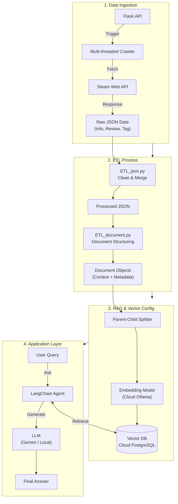

# Steam Games Database with RAG 🎮

[](https://www.python.org/)
[](https://www.langchain.com/)
[](LICENSE)

**這是一個結合資料工程 (Data Engineering) 與大型語言模型 (RAG) 的 Steam 遊戲數據分析專案。**

本專案旨在建構一個自動化的 pipeline，從 Steam 平台採集遊戲數據，進行標準化 ETL 處理，並建立向量資料庫 (Vector Database)。最終透過檢索增強生成 (RAG) 技術，讓使用者能夠以自然語言查詢遊戲資訊、評論摘要與隱藏特徵。

---

## ✨ 核心功能 (Key Features)

-   **自動化爬蟲系統**: 支援多執行緒背景採集 Steam 遊戲 ID、詳細資訊、使用者評論與標籤。
-   **ETL 資料管線**:
    -   **清洗**: 自動去除 HTML 標籤、標準化價格與日期格式。
    -   **特徵工程**: 攤平硬體需求巢狀結構，計算評價指標。
    -   **結構化**: 將異質資料轉換為適合 RAG 檢索的 Document 格式。
-   **RAG 檢索增強生成**:
    -   **Hybrid Retrieval**: 採用 Parent-Document Retriever 策略，兼顧檢索精準度 (Child Chunk) 與上下文完整性 (Parent Chunk)。
    -   **Cloud Integration**:
        -   **Vector DB**: 使用 **Cloud PostgreSQL (pgvector)** 儲存與檢索高維向量。
        -   **Embedding**: 介接 **Cloud Ollama** 服務進行高效文本向量化。
    -   **Flexible LLM**: 支援 Google Gemini (Cloud) 與 LM Studio (Local) 切換。
-   **Flask API**: 提供 RESTful API 介面，可遠端觸發背景爬蟲任務。

---

## 🏗️ 系統架構 (Architecture)

本專案採用模組化設計，包含資料擷取、ETL 處理、向量化與 RAG 應用四個主要階段。



---

## 📂 專案結構 (Directory Structure)

詳細目錄說明請參閱 [Docs/Project Structure](docs/project_structure.md)。

```text
Steam-Games-Database-with-RAG/
├── app.py                 # Flask 應用程式入口 (API Server)
├── data/                  # 資料儲存區 (Raw, Processed)
├── docs/                  # 專案文件
├── notebooks/             # 實驗與測試用的 Jupyter Notebooks
├── src/                   # 核心原始碼
│   ├── crawler/           # 爬蟲模組 (GameID, Info, Review, Tag)
│   ├── ETL/               # 資料清洗與轉換腳本
│   ├── embedding/         # 文本向量化邏輯 (Cloud Ollama)
│   ├── llm/               # RAG Agent 與 LLM 串接
│   ├── database/          # 資料庫連線模組 (PostgreSQL)
│   └── utils/             # 通用工具
├── requirements.txt       # Python 依賴清單
└── .env                   # 環境變數設定 (API Keys, DB Config)
```

---

## 🚀 快速開始 (Quick Start)

### 1. 環境準備

確保您的系統已安裝 Python 3.10+，並建議使用虛擬環境。

```bash
# Clone 專案
git clone https://github.com/your-username/Steam-Games-Database-with-RAG.git
cd Steam-Games-Database-with-RAG

# 建立虛擬環境 (Optional)
python -m venv venv
source venv/bin/activate  # Windows: venv\Scripts\activate

# 安裝依賴
pip install -r requirements.txt
```

### 2. 設定環境變數

在專案根目錄建立 `.env` 檔案，填入 Database 連線資訊與 API Key：

```ini
# .env

# Steam API
STEAM_API_KEY=your_steam_api_key

# Database Config (Cloud PostgreSQL)
PG_HOST=your_db_host
PG_DATABASE=your_db_name
PG_USERNAME=your_db_user
PG_PASSWORD=your_db_password
PG_PORT=5432
PG_COLLECTION=steam_games_DB

# Embedding Service (Cloud Ollama)
OLLAMA_URL=https://your-ollama-service-url
EMBEDDING_MODEL=bge-m3

# LLM Provider
GOOGLE_API=your_google_gemini_key  # 若使用 Gemini
# OLLAMA_LOCAL=http://localhost:11434 # 若使用 Local Ollama
```

### 3. 啟動爬蟲服務

執行 Flask App 以啟動 API Server：

```bash
python app.py
```

伺服器啟動後 (預設 Port 8080)，可透過瀏覽器或 Postman 觸發爬蟲：
-   **取得遊戲詳細資訊**: `http://localhost:8080/run/info`
-   **取得遊戲評論**: `http://localhost:8080/run/review`
-   **取得遊戲標籤**: `http://localhost:8080/run/tag`

> [!TIP]
> **建議雲端部署 (Cloud Deployment Recommended)**
> 由於 Steam 遊戲資料量龐大 (約 150,000 筆)，完整爬取極為耗時。建議將本專案部署至雲端平台 (如 Zeabur, AWS, GCP)，並透過 `app.py` 提供的 API 介面在背景觸發爬蟲任務。

### 4. 執行 ETL 與 RAG 流程

目前 ETL 與 RAG 功能建議透過 Jupyter Notebook 進行互動式操作與驗證：

-   **資料清洗**: 執行 `notebooks/ETL_json.ipynb`
-   **建立向量庫**: 執行 `notebooks/text_embedding.ipynb` (將調用 Cloud Ollama 與 PostgreSQL)
-   **RAG 對話測試**: 執行 `notebooks/llm.ipynb`

---

## 🗓️ 開發藍圖 (Roadmap)

- [x] **資料擷取**: 實作 Steam 基礎資訊、評論與標籤爬蟲。
- [x] **基礎 ETL**: 完成 JSON 清洗、攤平與結構化轉換。
- [x] **RAG 原型**: 建立基於 Parent-Document 的檢索系統。
- [x] **資料庫優化**: 導入 Cloud PostgreSQL (pgvector) 支援高效向量檢索。
- [x] **模型服務化**: 介接 Cloud Ollama 作為 Embedding 服務端點。
- [ ] **雲端部署**: 容器化應用並部署至 Zeabur/GCP。
- [ ] **GUI 介面**: 開發 Streamlit 或 Gradio 介面，提供友善的對話視窗。

---

## 📝 License

This project is licensed under the MIT License - see the [LICENSE](LICENSE) file for details.
